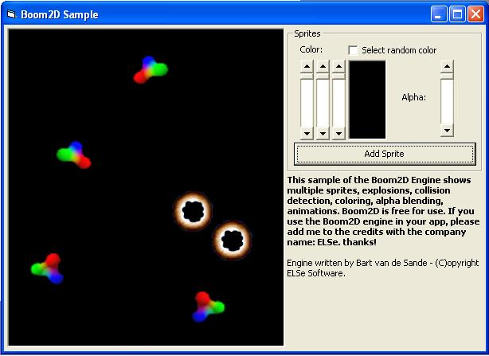



## A Boom2D DirectX8 Engine \+ Cool sample\!\!

### Description

Boom2D is a 2D engine that uses DirectX 8.0, features include:

- Sprites

- ANIMATED sprites

- Coloring sprites

- Collision detection

- Tiles

- Alpha blending

- Rotating sprites

- Scrolling

- Scaling sprites

- Fullscreen + Windowed mode

- Drawing text

- Multiple windows

- Colorkeys on sprites

- And more...

Uses Direct3D.

This also includes a sample program of some stuff you can do with the engine.

Please vote for me!
 
### More Info
 

             |
---                |---
**Submitted On**   |2002-08-26 11:39:12
**By**             |[Bart van de Sande](https://github.com/Planet-Source-Code/PSCIndex/blob/master/ByAuthor/bart-van-de-sande.md)
**Level**          |Intermediate
**User Rating**    |5.0 (60 globes from 12 users)
**Compatibility**  |VB 6\.0
**Category**       |[DirectX](https://github.com/Planet-Source-Code/PSCIndex/blob/master/ByCategory/directx__1-44.md)
**World**          |[Visual Basic](https://github.com/Planet-Source-Code/PSCIndex/blob/master/ByWorld/visual-basic.md)
**Archive File**   |[A\_Boom2D\_D1226768262002\.zip](https://github.com/Planet-Source-Code/bart-van-de-sande-a-boom2d-directx8-engine-cool-sample__1-38321/archive/master.zip)

